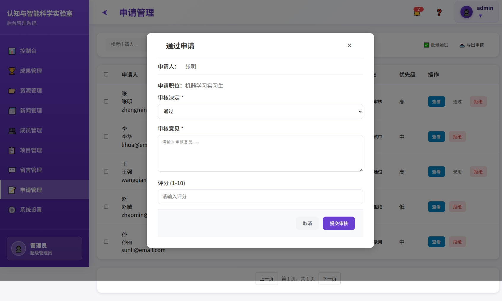

# 认知与智能科学实验室 - 网站设计文档

## 项目概述

本项目是认知与智能科学实验室的官方网站，包含前台展示页面和后台管理系统。整体设计采用现代化的扁平化风格，注重用户体验和视觉层次。

## 设计理念

### 整体风格
- **现代简约**：采用扁平化设计，减少不必要的装饰元素
- **科技感**：使用渐变色彩和几何图形营造科技氛围
- **专业性**：保持学术机构的严谨和专业形象
- **响应式**：适配不同设备尺寸，提供良好的移动端体验

## 色彩方案

### 主色调
- **主色**：#6c3fd3（紫色）- 体现科技感和创新性
- **辅助色**：#4b249c（深紫色）- 用于强调和层次
- **背景色**：#f6f6fa（浅灰紫）- 营造舒适的视觉环境

### 功能色彩
- **成功色**：#10b981（绿色）- 成功状态和正面反馈
- **警告色**：#f59e0b（橙色）- 提醒和注意信息
- **错误色**：#ef4444（红色）- 错误和危险状态
- **信息色**：#3b82f6（蓝色）- 信息和链接

## 前台页面设计

### 1. 首页 (index.html)
**设计特点：**
- 全屏视差滚动效果
- 大标题采用渐变文字效果
- 卡片式布局展示核心信息
- 动态背景和悬浮效果

**主要元素：**
- 导航栏：固定顶部，半透明背景
- 英雄区域：全屏展示，渐变背景
- 内容区域：卡片网格布局
- 页脚：深色背景，信息整合

### 2. 实验室简介 (about.html)
**设计特点：**
- 时间轴式布局展示发展历程
- 图文并茂的内容展示
- 团队介绍采用卡片式设计
- 响应式图片画廊

### 3. 科研方向 (directions.html)
**设计特点：**
- 分类标签式导航
- 图标化展示研究方向
- 交互式内容切换
- 进度条展示研究进展

### 4. 成果展示 (achievements.html)
**设计特点：**
- 瀑布流布局展示成果
- 分类筛选功能
- 详情弹窗展示
- 时间线展示发展历程

### 5. 资源下载 (resources.html)
**设计特点：**
- 文件类型图标化
- 搜索和筛选功能
- 下载进度显示
- 分类标签系统

### 6. 新闻动态 (news.html)
**设计特点：**
- 新闻卡片式布局
- 时间轴展示
- 分类标签
- 分页导航

### 7. 联系我们 (contact.html)
**设计特点：**
- 地图集成
- 联系信息卡片
- 表单验证
- 响应式布局

### 8. 加入我们 (join.html)
**设计特点：**
- 职位卡片展示
- 申请表单
- 进度指示器
- 状态反馈

## 后台管理系统设计

### 整体风格
- **深色主题**：深色侧边栏配合浅色内容区
- **卡片式布局**：信息分组清晰
- **数据可视化**：图表和统计展示
- **操作便捷**：批量操作和快捷入口

### 登录页面

### 1. 控制台 (dashboard.html)
**设计特点：**
- 数据统计卡片
- 实时图表展示
- 快捷操作按钮
- 活动时间线

### 2. 成果管理 (achievements.html)
**设计特点：**
- 表格化数据展示
- 批量操作工具栏
- 状态标签系统
- 搜索和筛选

### 3. 资源管理 (resources.html)
**设计特点：**
- 文件上传界面
- 分类管理
- 权限控制
- 使用统计

### 4. 新闻管理 (news.html)
**设计特点：**
- 富文本编辑器
- 草稿保存
- 发布状态管理
- 媒体库集成

### 5. 成员管理 (members.html)
**设计特点：**
- 成员信息卡片
- 角色权限管理
- 进度跟踪
- 团队结构展示

### 6. 项目管理 (projects.html)
**设计特点：**
- 项目看板
- 进度可视化
- 任务分配
- 里程碑管理

### 7. 留言管理 (messages.html)
**设计特点：**
- 消息列表
- 回复系统
- 状态跟踪
- 批量处理

### 8. 申请管理 (applications.html)
**设计特点：**
- 申请流程管理
- 状态更新
- 审核界面
- 通知系统

### 9. 系统设置 (settings.html)
**设计特点：**
- 分标签页设置
- 主题切换
- 权限配置
- 系统信息

### 10. 全部通知 (all-notifications.html)
**设计特点：**
- 通知分类标签
- 批量操作
- 搜索功能
- 详情弹窗

## 交互设计

### 动画效果
- **过渡动画**：页面切换和元素状态变化
- **悬浮效果**：按钮和卡片的交互反馈
- **加载动画**：数据加载时的视觉反馈
- **微交互**：细节处的动画增强体验

### 响应式设计
- **移动优先**：优先考虑移动端体验
- **断点设计**：768px、1024px、1200px
- **弹性布局**：使用Flexbox和Grid
- **图片适配**：响应式图片和图标

### 无障碍设计
- **语义化HTML**：正确的标签使用
- **键盘导航**：支持键盘操作
- **颜色对比**：确保文字可读性
- **屏幕阅读器**：支持辅助技术

## 技术实现

### 前端技术
- **HTML5**：语义化标记
- **CSS3**：现代样式和动画
- **JavaScript**：交互逻辑
- **响应式框架**：自定义CSS框架

### 设计工具
- **设计系统**：统一的设计规范
- **组件库**：可复用的UI组件
- **图标系统**：统一的图标风格
- **字体规范**：中英文字体搭配

## 维护指南

### 样式维护
- 使用CSS变量管理颜色
- 模块化CSS组织
- 统一的命名规范
- 版本控制管理

### 内容更新
- 图片优化和压缩
- 内容管理系统
- 定期备份
- 性能监控

---

*本文档持续更新，反映最新的设计决策和实现细节。* 